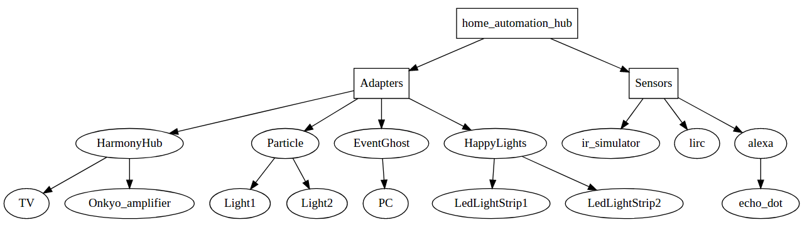

[](https://travis-ci.org/function61/hautomo)
[](https://bintray.com/function61/dl/hautomo/_latestVersion#files)

Home automation hub built to serve my specific requirements.

Due to Golang runs pretty much anywhere, but some specifics work best with a Raspberry Pi.


Features
--------

- Powering devices on/off. Alexa: `tv on`, `amplifier off`
- Color of lights. Alexa: `set kitchen lights to yellow`
- Dimming lights. Alexa: `dim kitchen lights to 50 percent`
- Controlling playback. Alexa: `pause computer` (context dependent, f.ex. pauses/resumes Spotify, YouTube or Netflix)
- Routines (via Alexa), for example every weekday morning turn bedroom lights on, read news and weather.
- Infrared remapping (receive via LIRC, transmit via Logitech Harmony Hub).
  Dedicate any remote to use with your home automation. When remote button pressed,
  send IR signal to a device not originally controlled by that remote.


Supported integrations
----------------------

- Voice control for all of this (via Alexa)
- [IKEA Trådfri](https://www.ikea.com/us/en/catalog/categories/departments/lighting/smart_lighting/)
  lights and Trådfri wall sockets
- Infrared devices (via [HarmonyHub](https://www.logitech.com/en-us/product/harmony-hub))
- Custom 433 MHz power sockets (via custom hardware attached to [Particle](https://www.particle.io/))
- Computer (via [EventGhost](http://www.eventghost.net/))
- Happylights
- MCEUSB (via LIRC)
- Logitech Harmony Hub
- Wall power sockets (via custom hardware)


Adapters / sensors architecture
-------------------------------




Configuring
-----------

Configured using [HCL syntax](https://www.terraform.io/docs/configuration/syntax.html). Example config file:

(TODO: some of the options here are outdated)

```

adapter {
	id = "sqs"
	type = "sqs"

	sqs_queue_url = "https://sqs.us-east-1.amazonaws.com/1234567890/HomeAutomation"

	sqs_key_id = "AKIAIDJJXAOTADKM"
	sqs_key_secret = "..."
}

adapter {
	id = "harmonyHubAdapter"
	type = "harmony"

	harmony_addr = "192.168.1.153:5222"
}

adapter {
	id = "lirc"
	type = "lirc"
}

device {
	id = "c0730bb2"
	adapter = "harmonyHubAdapter"
	adapters_device_id = "47917687"
	name = "Amplifier"
	description = "Onkyo TX-NR515"
	power_on_cmd = "PowerOn"
	power_off_cmd = "PowerOff"
}

device {
	id = "7e7453da"
	adapter = "harmonyHubAdapter"
	adapters_device_id = "47918441"
	name = "TV"
	description = "Philips 55'' 4K 55PUS7909"

	# for some reason the TV only wakes up with PowerToggle, not PowerOn
	power_on_cmd = "PowerToggle"
	power_off_cmd = "PowerOff"
}

devicegroup {
	id = "cfb1b27f"
	name = "All devices"

	device_ids = [ "c0730bb2", "7e7453da" ]
}

ir2ir {
	remote_key = "KEY_VOLUMEUP"
	to_device = "c0730bb2"
	ir = "VolumeUp"
}

ir2ir {
	remote_key = "KEY_VOLUMEDOWN"
	to_device = "c0730bb2"
	ir = "VolumeDown"
}

```
